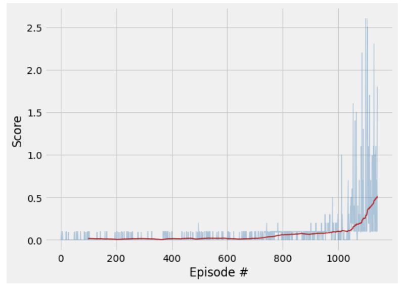
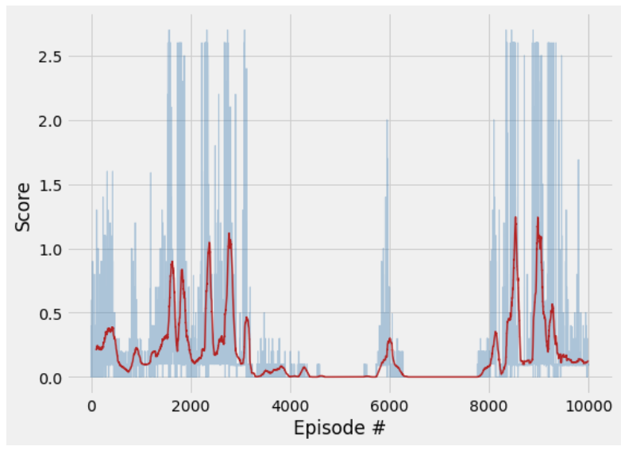

[//]: # (Image References)

[image1]: https://user-images.githubusercontent.com/10624937/42135623-e770e354-7d12-11e8-998d-29fc74429ca2.gif "Trained Agent"

# Project 3: Collaboration and Competition

##  Introduction
This project repository contains Tarun Rao's work for the Udacity's Deep Reinforcement Learning Nanodegree `Project 3:Collaboration and Competition`. For this project, we train a pair of agents to play [Tennis](https://github.com/Unity-Technologies/ml-agents/blob/master/docs/Learning-Environment-Examples.md#tennis).
The project environment is similar to, but not identical to the Tennis environment on the Unity ML-Agents GitHub page.
![Trained Agent][image1]

## Project's Environment
We were provided an environment built with Unity ML-Agent toolkit.
Here is the project description of the environment:
 - In this environment, two agents control rackets to bounce a ball over a net. If an agent hits the ball over the net, it receives a reward of +0.1.  If an agent lets a ball hit the ground or hits the ball out of bounds, it receives a reward of -0.01.  Thus, the goal of each agent is to keep the ball in play.

 - The observation space consists of 8 variables corresponding to the position and velocity of the ball and racket. Each agent receives its own, local observation.  Two continuous actions are available, corresponding to movement toward (or away from) the net, and jumping. 

 - The task is episodic, and in order to solve the environment, your agents must get an average score of +0.5 (over 100 consecutive episodes, after taking the maximum over both agents). Specifically,

- After each episode, we add up the rewards that each agent received (without discounting), to get a score for each agent. This yields 2 (potentially different) scores. We then take the maximum of these 2 scores.
- This yields a single **score** for each episode.

The environment is considered solved, when the average (over 100 episodes) of those **scores** is at least +0.5.

## Project Environment Setup/ Configuring Dependencies:
### Requirements
 - python 3
 - pytorch (Instructions: https://pytorch.org/)
 - unityagent (Instructions: https://github.com/Unity-Technologies/ml-agents)
 - Jupyter
 - Numpy
 - Matplotlib
 - Tennis Unity Environment (Linux),(OSX), (Win64),(Win32)
 
#### Step 1: Installing the Dependencies
 - To be able to run this code, you will need an environment with Python 3 and the dependencies as listed above and can be found in the requirements.txt file so that you can install them using the following command:
`pip install requirements.txt`

#### Step 2: Download the Unity Environment
1. Download the environment from one of the links below.  You need only select the environment that matches your operating system:
    - Linux: [click here](https://s3-us-west-1.amazonaws.com/udacity-drlnd/P3/Tennis/Tennis_Linux.zip)
    - Mac OSX: [click here](https://s3-us-west-1.amazonaws.com/udacity-drlnd/P3/Tennis/Tennis.app.zip)
    - Windows (32-bit): [click here](https://s3-us-west-1.amazonaws.com/udacity-drlnd/P3/Tennis/Tennis_Windows_x86.zip)
    - Windows (64-bit): [click here](https://s3-us-west-1.amazonaws.com/udacity-drlnd/P3/Tennis/Tennis_Windows_x86_64.zip)
2. Then, place the file in the `p3_collab-compet_Submission_NishiSood/` folder in the DRLND GitHub repository, and unzip (or decompress) the file.

## Code Description
 - `Tennis_Env_Exploration.ipynb` : explore the unity environment and verify the setup
 - `Tennis_Solution.ipynb` : Notebook used to control and train the agent
 - `Requirements.txt `: dependencies to run the project
 - `ddpg_agent.py`: Create an DDPG Agents class that interacts with and learns from the environment
 - `model.py` : Actor and Critic classes
 - `models/checkpoint-in-the-long-run.pth` : Saved Model for the Long Run
 - `models/checkpoint-solved.pth` : Saved Model for the Solved environment
 - `Project3_Report.pdf`: Technical report
 - `README.md` : describes the project environment details 
 
## Steps to Run the Project
 - Download the environment and unzip it into the directory of the project. Ensure that it contains `Tennis.exe`.
 - Use jupyter to run the Tennis_solution.ipynb notebook: `jupyter notebook Tennis_solution.ipynb`
 - To train the agent run the cells in order. They will initialize the environment and train until it reaches the goal condition of +0.5 average over 100 episode.
 - A graph of the scores during training will be displayed after training.

## Results
 - The agents are trained until they solve the environment, that is to say when one the two agents obtains an average reward of at least +0:5 over the last 100 episode.
 - Using the specified setup and after hyperparameters tuning ,the environment was solved in about `1478 episodes in less than 5 min on a laptop and without GPU`.

 
### Plot of the result
Below the plot of scores over episodes:

	

## Trained agents in action

	

## Ideas for future work
 - Try implementing this concept in much challenging soccer environment
 - Hyperparameter optimization
- The plot below highlighting the instability of the learning after having solved the environment.

	

