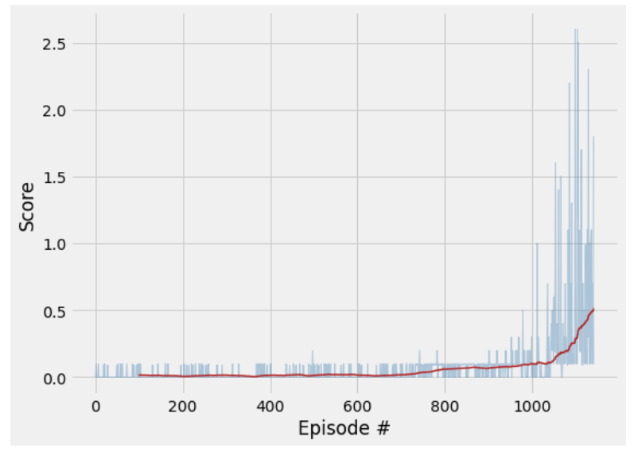
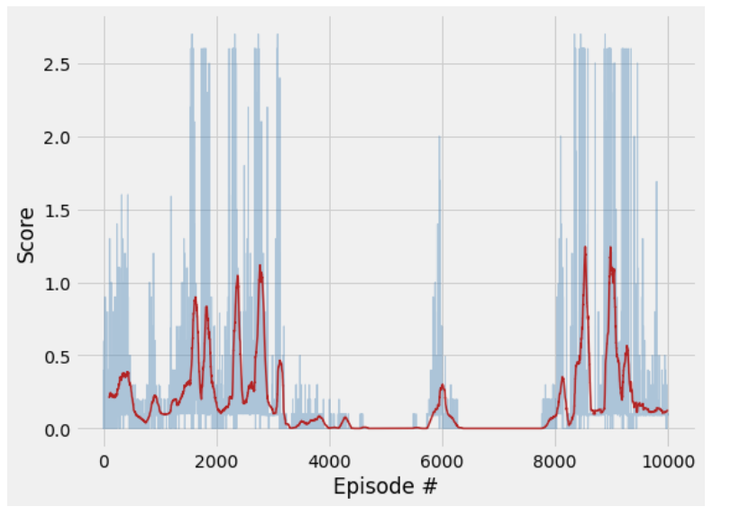

[//]: # (Image References)

[image1]: https://user-images.githubusercontent.com/10624937/42135623-e770e354-7d12-11e8-998d-29fc74429ca2.gif "Trained Agent"

# Deep Reinforcement Learning : Project 3: Collaboration and Competition 
### Author : Tarun Rao

## Summary

For this project, we worked with the [Tennis](https://github.com/Unity-Technologies/ml-agents/blob/master/docs/Learning-Environment-Examples.md#tennis) environment.
![Trained Agent][image1]

In this environment, two agents control rackets to bounce a ball over a net. If an agent hits the ball over the net, it receives a reward of +0.1.  If an agent lets a ball hit the ground or hits the ball out of bounds, it receives a reward of -0.01.  Thus, the goal of each agent is to keep the ball in play.

The observation space consists of 8 variables corresponding to the position and velocity of the ball and racket. Each agent receives its own, local observation.  Two continuous actions are available, corresponding to movement toward (or away from) the net, and jumping. 

The task is episodic, and in order to solve the environment, your agents must get an average score of +0.5 (over 100 consecutive episodes, after taking the maximum over both agents). Specifically,

- After each episode, we add up the rewards that each agent received (without discounting), to get a score for each agent. This yields 2 (potentially different) scores. We then take the maximum of these 2 scores.
- This yields a single **score** for each episode.

The environment is considered solved, when the average (over 100 episodes) of those **scores** is at least +0.5.

## Why Multi-agent RL Matters?

 - For artificial intelligence (AI) to reach its full potential, AI systems need to interact safely and efficiently with humans, as well as other agents. 
 - There are already environments where this happens daily, such as the stock market. And there are future applications that will rely on productive agent-human interactions, such as self-driving cars and other autonomous vehicles.
 - One step along this path is to train AI agents to interact with other agents in both cooperative and competitive settings. 
 
## Projects Goal
The goal of this project is to train two RL agents to play tennis. As in real tennis, the goal of each player is to keep the ball in play. And, when you have two equally matched opponents, you tend to see long exchanges where the players hit the ball back and forth over the net.

## Learning algorithms
The goal of this project is to Deep Reinforcement Learning algorithms to solve an environment where:
 - both states and actions are continuous
 - two agents play against each other.

## DDPG
 - [DDPG (Deep Deterministic Policy Gradient)](https://arxiv.org/abs/1509.02971) algorithm is one of the state-of-the-art technique to handle efficiently continuous states and actions. 
 - The original DQN works in discrete space, and DDPG extends it to continuous space
with the actor-critic framework while learning a deterministic policy.
 - In DDPG, we use 2 deep neural networks : one is the actor and the other is the critic:
<p align="center">
	
</p>

## Multi-Agent Deep Deterministic Policy Gradient
 - Multi-Agent Deep Deterministic Policy Gradient (MADDPG) algorithm is a new population DRL algorithm, which is proposed by Lowe et al.
 - It can find the global optimization solution and can easily defeat various DRL methods, including DQN (Deep Q-Network), TRPO (Trust region policy optimization) and DDPG (Deep Deterministic Policy Gradient). 
 - MADDPG is a kind of "Actor-Critic" method. 
 - Unlike DDPG algorithm which trains each agent independently, MADDPG trains actors and critics using all agent’s information (actions and states). However, the trained agent model (actor) can make an inference independently using its own state.
<p align="center">
	
</p>

## Modification
In this report, we will focus on the modification made on the standard DDPG to solve the Tennis environment.

In our specific scenario, it is important to recognize the symmetrical nature of the problem as both agents:
 - receive same type of reward;
 - observe same type of states;
 - and have same actions space.

As a result, our first approach was "simply" to re-use/adapt DDPG algorithm in a multi-agent setting where each agent:
 - store their experiences in a shared replay buffer and;
 - share the same actor and critic network.

## Training algorithm
 - Actor Network and Critic Network of target agents are soft-updated respectively.
 - The agents using the current policy and exploration noise interact with the environment.
 - All the episodes are saved into the shared replay buffer.
 - For each agent, using a minibatch which is randomly selected from the reply buffer, the critic and the actor are trained using MADDPG training algorithm.
 
## Hyperparameters
Based on lessons learnt from  `Project 2 "Continuous control”`, we tuned hyperparameters along the following axis of optimization:
 - `speeding learning` by training both Actor and Critic networks `2 times every 5 actions`. 
 - `increase variety of experiences` by tweaking both BUFFER BATCH SIZE of the experience replay buffer and;
 - `stability` through clipping gradient and batch normalization.
 
```
# Runner
n_episodes=10000        # maximum number of training episodes
min_noise=0.02          # maximum number of timesteps per episode

# Agent
BUFFER_SIZE = int(1e6)  # replay buffer size
BATCH_SIZE = 512        # minibatch size
GAMMA = 0.99            # discount factor
TAU = 1e-3              # for soft update of target parameters
LR_ACTOR = 1e-3         # learning rate of the actor 
LR_CRITIC = 1e-3        # learning rate of the critic
WEIGHT_DECAY = 0        # L2 weight decay

# Neural Networks (both Actor & Critic)
hidden_layers = [128, 64]

```

## Agent Training Outcome

 - The agents are trained until they solve the environment, that is to say when one the two agents obtains an average reward of at least +0:5 over the last 100 episode.
 - Using the specified setup and after hyperparameters tuning ,the environment was solved in about `1141 episodes in less than 5 min on a laptop and without GPU`.

 
### Plot of the result
Below the plot of scores over episodes:




### Monitoring Agent beyond solving scores in the long run
 - The plot below highlighting the instability of the learning after having solved the environment.


The scores are quite noisy, as it is often the case with multi-agent tasks, but they did not crash as we kept the agents for 10000 episodes total.


## Ideas for future work
 - Need to try implementing thisw concept in a more challenging soccer game environment
 - Hyperparameter optimization 


